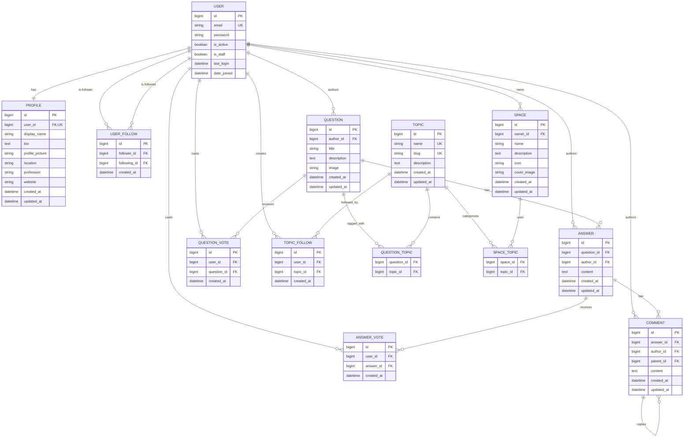

# Quora ER Diagram

```mermaid
erDiagram
    USER ||--|| PROFILE : has
    USER ||--o{ USER_FOLLOW : "is follower"
    USER ||--o{ USER_FOLLOW : "is followed"
    USER ||--o{ QUESTION : authors
    USER ||--o{ ANSWER : authors
    USER ||--o{ QUESTION_VOTE : casts
    USER ||--o{ ANSWER_VOTE : casts
    USER ||--o{ COMMENT : authors
    USER ||--o{ TOPIC_FOLLOW : creates
    USER ||--o{ SPACE : owns

    QUESTION ||--o{ ANSWER : has
    QUESTION ||--o{ QUESTION_VOTE : receives
    QUESTION ||--o{ QUESTION_TOPIC : tagged_with

    TOPIC ||--o{ QUESTION_TOPIC : contains
    TOPIC ||--o{ TOPIC_FOLLOW : followed_by
    TOPIC ||--o{ SPACE_TOPIC : categorizes

    ANSWER ||--o{ ANSWER_VOTE : receives
    ANSWER ||--o{ COMMENT : has

    COMMENT ||--o{ COMMENT : replies

    SPACE ||--o{ SPACE_TOPIC : uses

    USER {
        bigint id PK
        string email UK
        string password
        boolean is_active
        boolean is_staff
        datetime last_login
        datetime date_joined
    }

    PROFILE {
        bigint id PK
        bigint user_id FK,UK
        string display_name
        text bio
        string profile_picture
        string location
        string profession
        string website
        datetime created_at
        datetime updated_at
    }

    USER_FOLLOW {
        bigint id PK
        bigint follower_id FK
        bigint following_id FK
        datetime created_at
    }

    QUESTION {
        bigint id PK
        bigint author_id FK
        string title
        text description
        string image
        datetime created_at
        datetime updated_at
    }

    ANSWER {
        bigint id PK
        bigint question_id FK
        bigint author_id FK
        text content
        datetime created_at
        datetime updated_at
    }

    TOPIC {
        bigint id PK
        string name UK
        string slug UK
        text description
        datetime created_at
        datetime updated_at
    }

    QUESTION_TOPIC {
        bigint question_id FK
        bigint topic_id FK
    }

    TOPIC_FOLLOW {
        bigint id PK
        bigint user_id FK
        bigint topic_id FK
        datetime created_at
    }

    QUESTION_VOTE {
        bigint id PK
        bigint user_id FK
        bigint question_id FK
        datetime created_at
    }

    ANSWER_VOTE {
        bigint id PK
        bigint user_id FK
        bigint answer_id FK
        datetime created_at
    }

    COMMENT {
        bigint id PK
        bigint answer_id FK
        bigint author_id FK
        bigint parent_id FK
        text content
        datetime created_at
        datetime updated_at
    }

    SPACE {
        bigint id PK
        bigint owner_id FK
        string name
        text description
        string icon
        string cover_image
        datetime created_at
        datetime updated_at
    }

    SPACE_TOPIC {
        bigint space_id FK
        bigint topic_id FK
    }
```